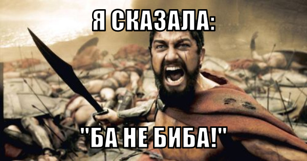

# meme-generator
Creator: [Aynur Shauerman](https://t.me/Sib_aynur)

[Builded version](https://aykuli.github.io/meme-generator)

React project made by lessons of Bob Zirol on scrimba.

## Prepare and test
1. Open folder with the project in [Visual Studio Code](https://code.visualstudio.com/download)
2. To install all dependencies use 

        npm install

3. To build project use

        npm run build

    There will appear folder `dist`, where will be files `index.html`, `main.js`, `main.css` and  folder `images`.
4. To run developing state use

        npm run dev
    